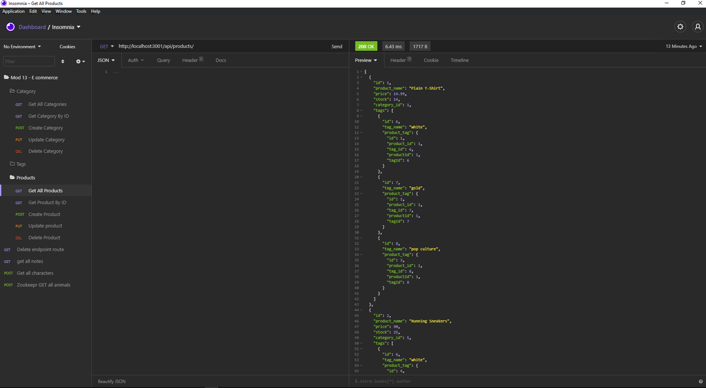

# E-comm BackEnd  
  

# Screenshot

# Description
Backend for an e-commerce site. where you can edit/update/delete, products, categories, and tags

# Table of Contents
*[Demo](#demo)  
*[Technology](#technology)  
*[Features](#features)  
*[Installation](#installation)  
*[Usage](#usage)  
*[Contribute](#contribute)  
*[Tests](#tests)  
*[Questions](#questions)  
*[License](#license)

# Demo
[DEMO: E-comm BackEnd](https://drive.google.com/file/d/1ODAmOQ3acfpk00P2NqJROLD9BqyQpCju/view)

# Technology 
| Technology | Description                        |Links ↘️ |
| ---------- | -----------------------------------| ------|  
|  | Javascript |  |

# Features
In this backend you can edit details, including name, price, tags categories for different products

# Installation  
Project Repository: [E-comm BackEnd](https://github.com/jmax407/E-commerce-Back-End)  
npm install express dotenv mysql2 sequelize 

# Usage
[E-comm BackEnd](https://jmax407.github.io/E-commerce-Back-End/)  
user can edit products using api routes

# Contribute 
n/a

# Tests
npm start, test api routes in insommnia

# Questions
Feel free to reach out if you have any questions

Contact via GitHub: [jmax407](https://github.com/jmax407)  
Send an email: [jmax407@gmail.com](mailto:jmax407@gmail.com)

# License
None
